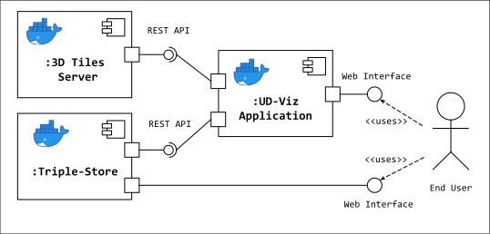

# UD-Demo-Workspace-GratteCiel

A demonstration for visualizing RDF semantic graphs alongside 3D City models using:
* [UD-Viz](https://github.com/VCityTeam/UD-Viz) a frontend web application for urban data visualization
  * In particular the [SPARQL module](https://github.com/VCityTeam/UD-Viz/tree/master/src/Widgets/Extensions/SPARQL) is used to visualize semantic urban data in the form of RDF
* [Strabon RDF Store](http://www.strabon.di.uoa.gr/) an RDF-Store for storing and serving geospatial semantic graph data in the form of RDF
* [PostGIS](https://postgis.net/) a geospatial database extension of [PostgreSQL](https://www.postgresql.org/) used here as a backend database for Strabon


### Component Diagram


## Installation

### Pre-requisites 

* [Install Docker](https://docs.docker.com/engine/install/)
* [Install Docker Compose](https://docs.docker.com/compose/install/)

### Repository setup
Currently, the UD-Viz framework must be initialized after cloning this repository.
```
git clone https://github.com/VCityTeam/UD-Demo-Workspace-GratteCiel.git
cd UD-Demo-Workspace-GratteCiel
git submodule init      # init UD-Viz
git submodule update    # update UD-Viz
```

### Component Setup
To configure the demo and the components that support it edit the `.env` file to be launched with docker-compose. By default the following ports are used by the following services:
- 8996: `PostGIS`
- 8997: `Strabon`
- 8000: `UD-Viz`

The following sections will describe how to configure this file for each component. 

### Build Images and run containers
First, build the PostGIS and Strabon docker images and run their containers:
```
docker-compose up
```

**Note:** Make sure to set the `sparqlModule/url` port in the `./ud-viz-context/config.json` file to the same port for the _Strabon_ container declared in the `.env` file.

Then install and run the UD-Viz application:
```
cd ud-viz-context
npm i
npm run debug
```

### Upload RDF-Store Dataset
To upload files into Strabon to be used by the sparqlModule:
1. Open a web browser and navigate to `localhost:8997/strabon`
2. From the left menu, click *Explore/Modify operations* then *Store*
3. Copy and paste the following URLs into the *URI Input* field and click *Store from URI*. ⚠️ Note: You may be asked to enter the Strabon administrative credentials here. However, these credentials currently cannot be changed from the `.env` file. See issue [#1](https://github.com/VCityTeam/UD-Demo-Graph-SPARQL/issues/1).
   1. `https://dataset-dl.liris.cnrs.fr/rdf-owl-urban-data-ontologies/Datasets/GratteCiel_Workspace_2009_2018/3.0/GratteCiel_2009_2018_Workspace.rdf`
   2. `https://dataset-dl.liris.cnrs.fr/rdf-owl-urban-data-ontologies/Datasets/GratteCiel_Workspace_2009_2018/3.0/Transition_2009_2012.rdf`
   3. `https://dataset-dl.liris.cnrs.fr/rdf-owl-urban-data-ontologies/Datasets/GratteCiel_Workspace_2009_2018/3.0/Transition_2012_2015.rdf`
   4. `https://dataset-dl.liris.cnrs.fr/rdf-owl-urban-data-ontologies/Datasets/GratteCiel_Workspace_2009_2018/3.0/Transition_2015_2018.rdf`
   5. `https://dataset-dl.liris.cnrs.fr/rdf-owl-urban-data-ontologies/Datasets/GratteCiel_Workspace_2009_2018/3.0/Transition_2009_2009b.rdf`
   6. `https://dataset-dl.liris.cnrs.fr/rdf-owl-urban-data-ontologies/Datasets/GratteCiel_Workspace_2009_2018/3.0/Transition_2009b_2012b.rdf`
   7. `https://dataset-dl.liris.cnrs.fr/rdf-owl-urban-data-ontologies/Datasets/GratteCiel_Workspace_2009_2018/3.0/Transition_2012b_2015.rdf`

   Optional:
   1. `https://dataset-dl.liris.cnrs.fr/rdf-owl-urban-data-ontologies/Datasets/GratteCiel_Workspace_2009_2018/3.0/GratteCiel_2009_alt_split.rdf`
   1. `https://dataset-dl.liris.cnrs.fr/rdf-owl-urban-data-ontologies/Datasets/GratteCiel_Workspace_2009_2018/3.0/GratteCiel_2009_split.rdf`
   1. `https://dataset-dl.liris.cnrs.fr/rdf-owl-urban-data-ontologies/Datasets/GratteCiel_Workspace_2009_2018/3.0/GratteCiel_2012_alt_split.rdf`
   1. `https://dataset-dl.liris.cnrs.fr/rdf-owl-urban-data-ontologies/Datasets/GratteCiel_Workspace_2009_2018/3.0/GratteCiel_2012_split.rdf`
   1. `https://dataset-dl.liris.cnrs.fr/rdf-owl-urban-data-ontologies/Datasets/GratteCiel_Workspace_2009_2018/3.0/GratteCiel_2015_split.rdf`
   1. `https://dataset-dl.liris.cnrs.fr/rdf-owl-urban-data-ontologies/Datasets/GratteCiel_Workspace_2009_2018/3.0/GratteCiel_2018_split.rdf`

Now the UD-Viz demo is ready and can be accessed from `localhost:8000`
